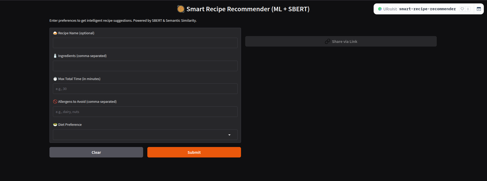

# 🍽️ Smart Recipe Recommender

An intelligent recipe recommendation system that suggests recipes based on user inputs like ingredients, cooking time, allergens, and diet preferences — powered by Sentence-BERT and deployed with Gradio.

---

## 🚀 Demo

🔗 Try it Live on [Hugging Face Spaces](https://urrohit-smart-recipe-recommender.hf.space/) 

---

## 📌 Features

- ✅ Input: recipe name, ingredients, max time, allergens, diet preference
- 🤖 Powered by **Sentence-BERT** for semantic similarity
- 🧠 Personalized recipe recommendations based on user input
- 🥗 Allergen and diet-aware filtering (e.g., dairy-free vegetarian)
- 🎯 Evaluation: **66% Precision@5**, **77% MRR** on test data
- 🖥️ Clean & interactive **Gradio UI**
- ☁️ Deployed free on Hugging Face Spaces

---

## 🗂️ Dataset

- Indian food recipe dataset with:
  - 🍛 Recipe names
  - 🧂 Ingredients
  - ⏱️ Cooking time
  - ⚠️ Allergen labels
  - 🌱 Diet (Vegetarian / Non-Vegetarian)

---

## 📊 Model Performance

| Metric        | Score     |
|---------------|-----------|
| Precision@5   | 66%       |
| Recall@5      | 29%       |
| MRR           | 77%       |

---

## 🧪 Tech Stack

- **Python**
- **Sentence-BERT** (NLP model)
- **Pandas, scikit-learn, NumPy**
- **Gradio** (UI)
- **Hugging Face Spaces** (Deployment)

---

## 🧠 How It Works

1. User provides inputs via a Gradio UI
2. Ingredients are embedded using SBERT
3. Cosine similarity is calculated with recipe dataset
4. Top-k most relevant recipes are filtered using constraints
5. Recommended recipes are displayed in a clean table
